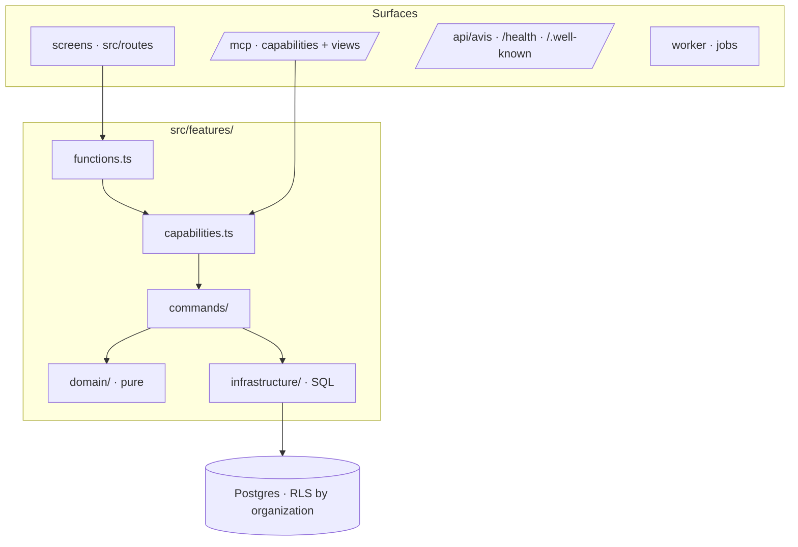

# Architecture

A modular monolith (doctrine ARCHITECTURE_APP §1): one deployment, cut into features. Every surface
— screens, MCP, API, worker — calls the same use cases.

| Concern           | Where                        | From kete-core                       |
| ----------------- | ---------------------------- | ------------------------------------ |
| Sign-in           | `platform/session.ts`        | `@kete/auth` (Compte Kete)           |
| Organization data | `platform/db.ts`             | `@kete/tenancy` (RLS)                |
| Rights            | `platform/rights.ts`         | `@kete/capabilities`, `@kete/center` |
| The center        | `platform/center.ts`         | `@kete/center` (Kete Enterprise)     |
| Gestures, journal | `features/*/commands`        | `@kete/commands`                     |
| Agents, drafts    | `platform/registry.ts`       | `@kete/capabilities`, `@kete/drafts` |
| Copilots          | `platform/mcp.ts`            | `@kete/capabilities`, `@kete/views`  |
| E-mails, jobs     | `platform/jobs.ts`           | `@kete/notify`, `@kete/jobs`         |
| Events, manifest  | `platform/events.ts`         | `@kete/sdk`                          |
| Feedback          | `lib/shell.tsx`, `/api/avis` | `@kete/feedback`                     |
| Journal           | `/journal`, `lib/journal.ts` | `@kete/admin` (audit)                |
| Design            | `platform/app.ts`, `styles/` | `@kete/design`                       |
