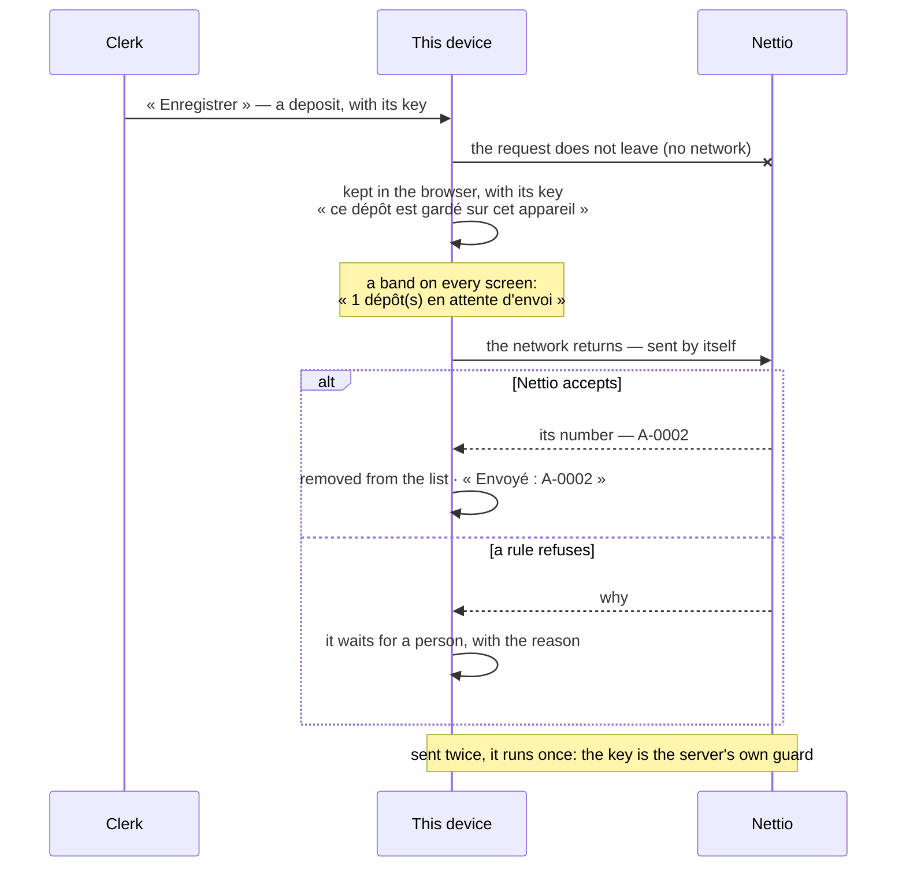
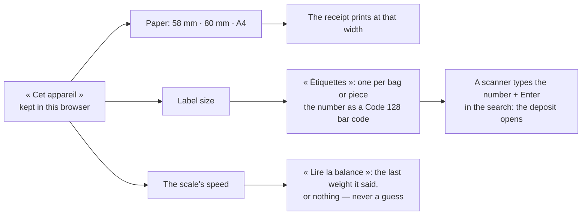

# A counter without network

```mermaid
sequenceDiagram
  participant C as Clerk
  participant D as This device
  participant N as Nettio
  C->>D: « Enregistrer » — a deposit, with its key
  D-xN: the request does not leave (no network)
  D->>D: kept in the browser, with its key<br/>« ce dépôt est gardé sur cet appareil »
  Note over D: a band on every screen:<br/>« 1 dépôt(s) en attente d'envoi »
  D->>N: the network returns — sent by itself
  alt Nettio accepts
    N-->>D: its number — A-0002
    D->>D: removed from the list · « Envoyé : A-0002 »
  else a rule refuses
    N-->>D: why
    D->>D: it waits for a person, with the reason
  end
  Note over D,N: sent twice, it runs once: the key is the server's own guard
```

A deposit is kept only when the request never reached Nettio. An answer — even a refusal — is
said at once and nothing is kept.

## What is plugged into this device

```mermaid
flowchart LR
  S[« Cet appareil »<br/>kept in this browser] --> P[Paper: 58 mm · 80 mm · A4]
  S --> L[Label size]
  S --> B[The scale's speed]
  P --> R[The receipt prints at that width]
  L --> E[« Étiquettes »: one per bag or piece<br/>the number as a Code 128 bar code]
  E --> Sc[A scanner types the number + Enter<br/>in the search: the deposit opens]
  B --> W[« Lire la balance »: the last weight it said,<br/>or nothing — never a guess]
```
