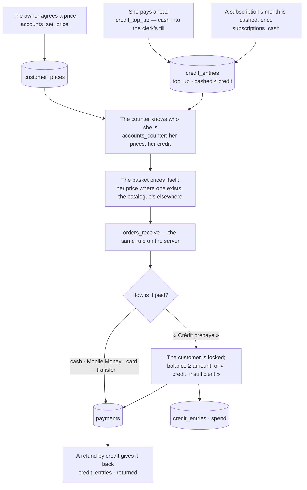
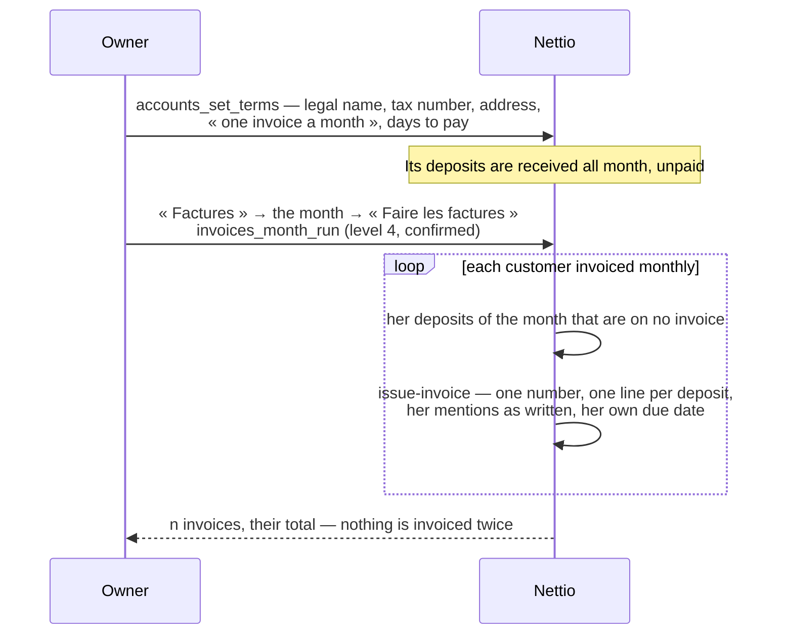

# A customer's account

## Her price, her credit, at the counter

The money figures keep their meaning. A till counts the cash that entered it, top-ups included.
« Cashed » — today, this month — counts money that came in: top-ups, and payments that are not
credit. A deposit paid with credit is paid; no money came in that day.

## A company and its month

A quote follows the same care as an invoice: numbered by year (`D-2026-0001`), its lines written
at the prices of the day, never rewritten.
