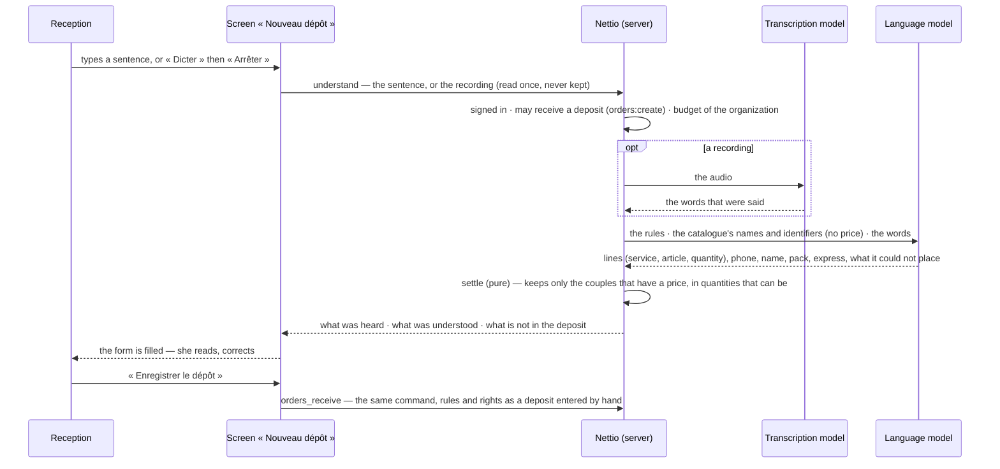

# A deposit said in a sentence, or dictated

The sentence writes nothing. What the model returns is a proposal for the form: `settle`
(`src/features/orders/domain/understand.ts`) drops every identifier it does not know, every piece
with no price for its service, every quantity that cannot be, and names what it dropped. A
sentence cannot touch a price, a discount or a payment: what is understood has no field for them.

Each call is metered to the organization — `deposit_voice` for the hearing, `deposit_entry` for
the understanding — as the agent `agt_nettio_listen` acting for the person.

Without `NETTIO_AI_*` the section is not shown; without `NETTIO_AI_TRANSCRIPTION_MODEL` only
« Dicter » is missing. Nothing is simulated.
