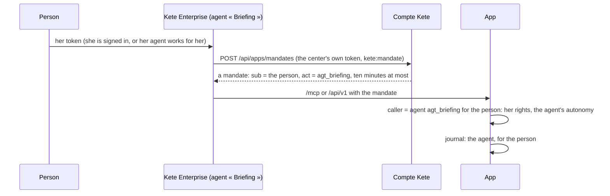

# An agent with a mandate

An agent of the center (Kete Enterprise) calls the app for a person with a **mandate**: a token the
Compte Kete signs, carrying the person's same claims and an `act` claim naming the agent (kete-core
spec 049, RFC 8693). The app knows who acts — the agent — and for whom — the person.

- **Never more than the person**: the mandate carries her claims only; her grants apply.
- **The agent's autonomy**: a decision (level 3 or 4) becomes a draft the person validates.
- **Not exchanged again**: a mandate never makes another mandate.
