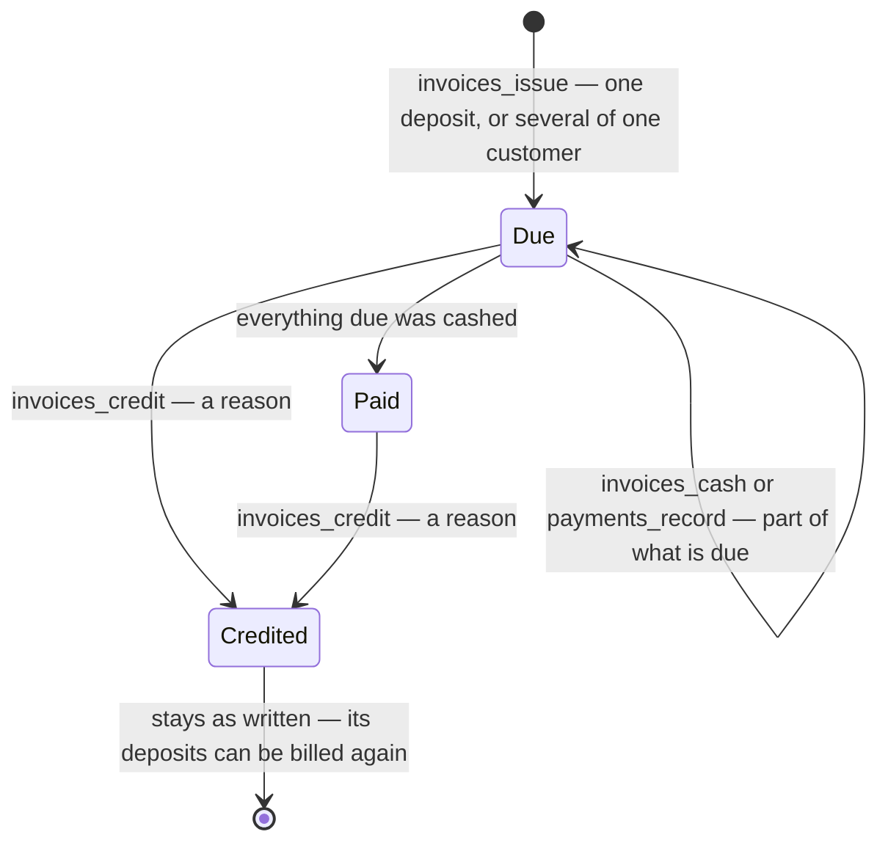
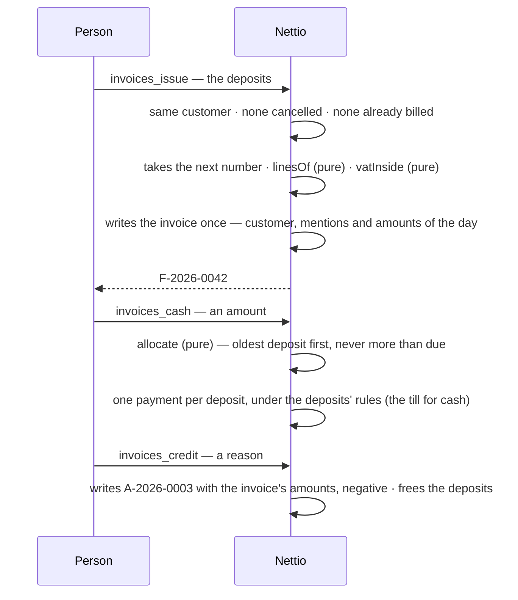

# An invoice, from a deposit to its credit note

An invoice is never changed nor deleted: the application role can only read and insert it. What
it was paid is what its deposits were paid — a payment at the counter and a payment on the invoice
are the same money. A credit note does not give money back: that is a refund, on the deposit.
