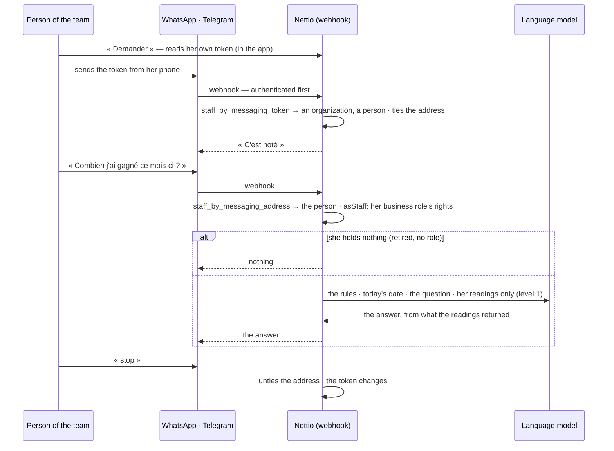

# Asking Nettio by message

A sender who is nobody of a team is a customer: the message goes on to the customers' path
(`docs/flows/a-deposit.md`). Across organizations the webhook reads identifiers only.

By message Nettio only reads. A gesture is prepared and confirmed in the application
(`docs/flows/asking-nettio.md`).
