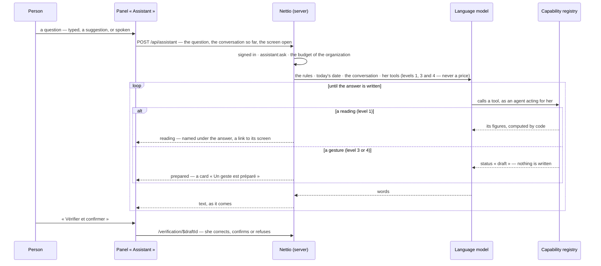

# Asking Nettio — the assistant's panel

The model never touches the database: it receives what its tools returned. The tools are the
person's — the registry applies her rights to each call — and a gesture called by an agent only
prepares a draft. What sets a price or a rate is not offered at all.

The answer is streamed as one JSON event per line: `text`, `reading`, `prepared`, `unavailable`,
`done`. The conversation is kept by the screen, and sent with each question.
