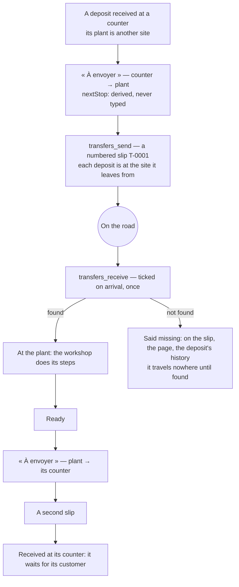
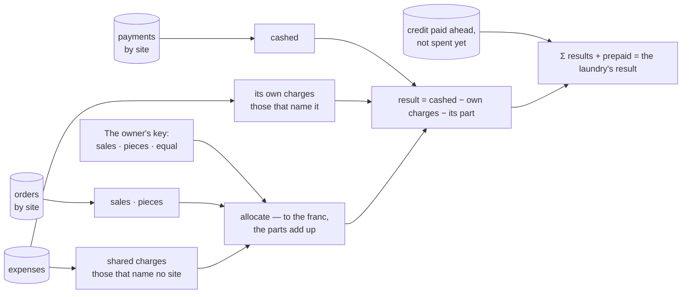

# Between the sites

Where a deposit is, is read from its last slip: sent — on the road; received and ticked — at the
destination; received and not ticked — missing. Nothing is stored twice.

## What each site earns

A partner's commission is a percentage of what its point received. It is said on the point's
line and not deducted: when the laundry pays it, it records an expense of that site — and the
result moves then, once.
