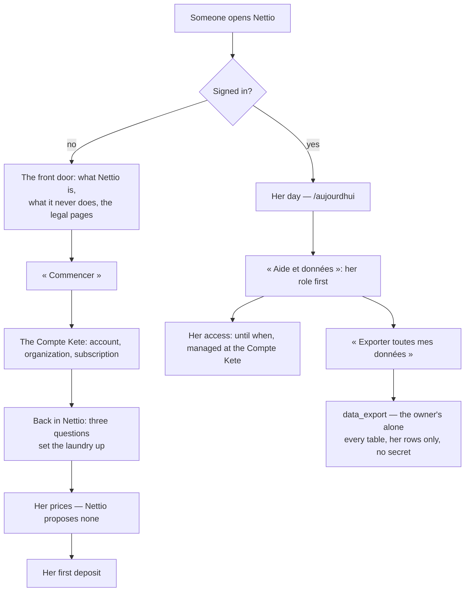

# Coming in alone

Every table a migration creates is in one of two lists — exported, or left out with its reason.
A test fails when a new table is in neither: a laundry's data never stays behind by oversight.
