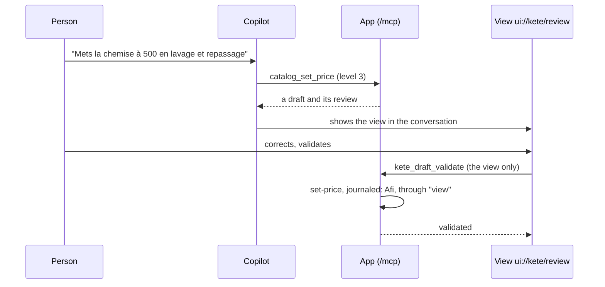

# A draft decided by a person

```mermaid
sequenceDiagram
  participant P as Person
  participant C as Copilot
  participant A as App (/mcp)
  participant V as View ui://kete/review
  P->>C: "Mets la chemise à 500 en lavage et repassage"
  C->>A: catalog_set_price (level 3)
  A-->>C: a draft and its review
  C->>V: shows the view in the conversation
  P->>V: corrects, validates
  V->>A: kete_draft_validate (the view only)
  A->>A: set-price, journaled: Afi, through "view"
  A-->>V: validated
```

Level 4 is decided at `/verification/$draftId`, with its confirmation; that address is always the
way back from a copilot.
