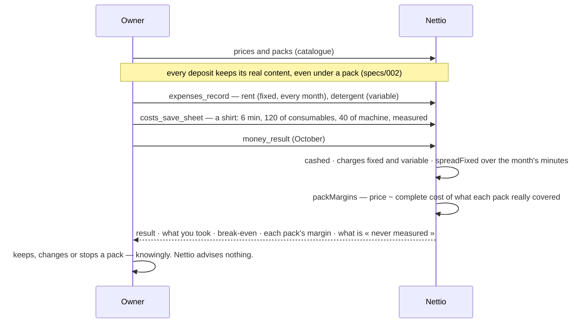

# Knowing whether I earn

At the counter, the same cost sheets feed the guard-rail: a deposit under its variable cost is
said while it is typed, and signed in its history.

A copilot may read `money_result` for the owner or his accountant; it computes nothing itself.
