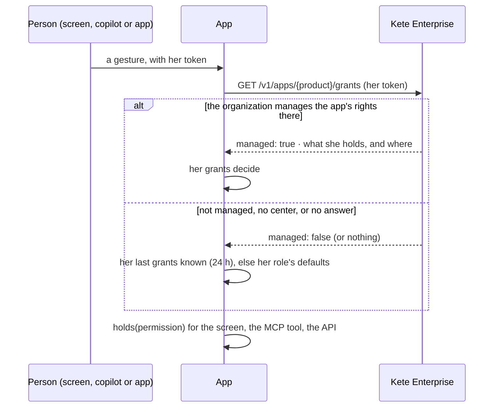

# Rights granted in Kete Enterprise

Each feature declares its permissions in its `policies.ts`, with their words in French and English
and the Compte Kete roles that hold them by default (kete-core spec 049). The manifest describes
them; Kete Enterprise lets an administrator tick them for a role, granted to positions.

- **Five minutes**: the grants are kept per token (by its hash), so a right ticked or withdrawn in
  Kete Enterprise applies within five minutes.
- **Only what the app declares**: a permission the app does not know is ignored.
- **An agent never holds more** than the person it acts for: the grants are hers.
