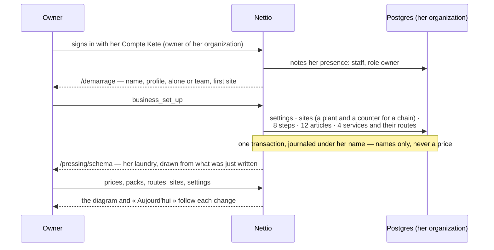
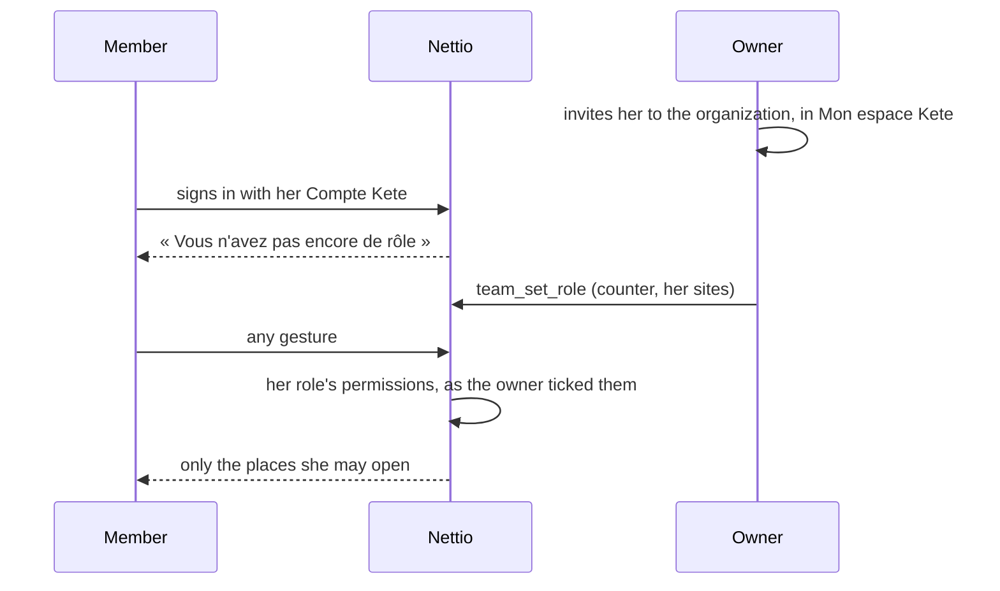

# Setting up a laundry

A second start is refused (`already_set_up`). Anyone else of the organization who signs in before
the start is told the laundry is not set up; afterwards she appears in « Équipe et droits »,
waiting for a role, and sees nothing of the business until the owner gives her one.

## A newcomer gets her role

