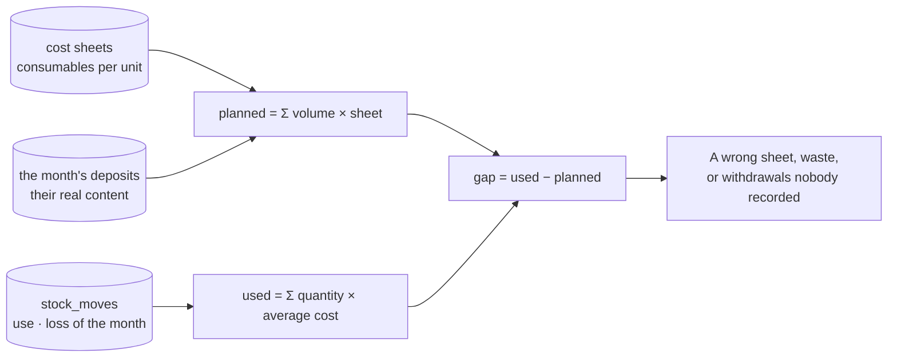

# Stock and purchasing

```mermaid
flowchart TD
  O[A purchase order to a supplier<br/>purchases_order — BC-0001] --> W((Waiting for its goods))
  W -- never came --> X[purchases_cancel]
  W --> R[purchases_receive — what really came,<br/>at what it really cost]
  R --> M[(stock_moves<br/>reception · + quantity · unit cost)]
  R --> D[The laundry owes it<br/>debt = received − paid]
  D --> P[suppliers_pay — level 4, never more than owed]
  P --> E[(expenses)<br/>record-expense: the till's rules,<br/>the month's charges]
  U[stock_use — used, or lost<br/>never more than the shelf holds] --> M
  I[stock_count — an inventory<br/>the gap is kept as a movement] --> M
  M --> L[level = Σ movements<br/>average cost = what was really paid]
  L --> S{At or under<br/>its threshold?}
  S -- yes --> A[« À faire » on the day:<br/>n consommable(s) à commander]
```

## Used against planned



The movements are never changed nor deleted. A level is their sum, so an inventory's gap is a
movement like any other — and stays visible.
