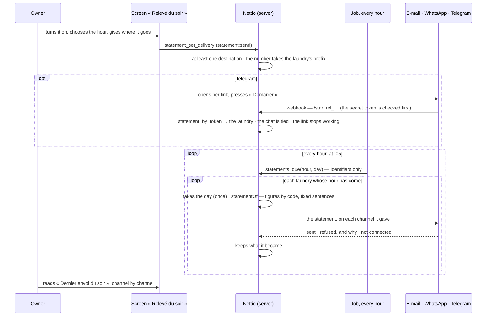

# The evening statement, sent by itself

The statement is the one of « Aujourd'hui » (`specs/007-intelligence`): no model writes any of it.
It is off until the owner turns it on; whoever receives it reads the laundry's money, so deciding
where it goes is its own permission (`statement:send`, the owner alone by default).

Across organizations the job reads identifiers only — which laundries are due — through a
function that returns nothing else. Each statement is then computed and sent inside its own
organization, under row-level security.

« Envoyer le relevé maintenant » runs the same sending on demand, to check that it arrives; it
does not count as the evening's.
