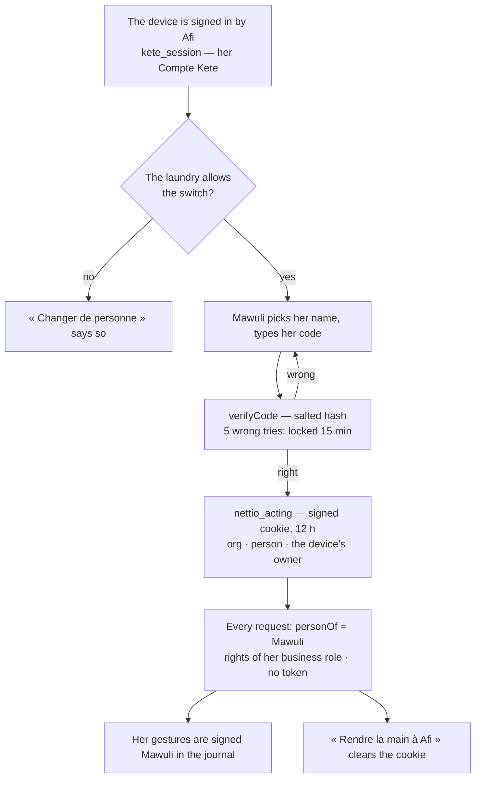
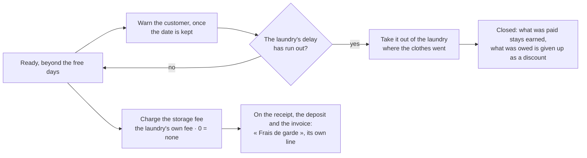

# A site that runs without its owner

## A clerk asks, a manager decides

```mermaid
sequenceDiagram
  participant C as Clerk (counter)
  participant N as Nettio
  participant M as Manager
  C->>N: « Demander une validation » on a deposit<br/>approvals_request (discount · cancel · refund, reason)
  N->>N: checkRequest against the deposit — nothing changes
  N-->>M: « À faire » and « Gérant » — and, by message,<br/>« Mawuli demande : Remise 500 F CFA sur A-0001… OUI 12 / NON 12 »
  alt on a screen
    M->>N: « Accorder » or « Refuser » — approvals_decide (level 4, confirmed)
  else on her WhatsApp or Telegram
    M->>N: « OUI 12 » — decidedByMessage, with her role's rights
  end
  N->>N: the request is locked; the rule is checked again
  alt granted
    N->>N: cancel-order · refund-payment · the discount<br/>in the manager's name, in the deposit's history
  else refused or stopped by a rule
    N->>N: the deposit does not change
  end
  N-->>C: her request reads « Accordé » or « Refusé »
```

An agent only prepares a request or a decision: both are drafts until a person confirms.

## One device, several people



The code is never a command's input — the journal keeps inputs. It is checked by a server
function and stored as `salt:scrypt`. The cookie is worth nothing on another session, in another
organization, or once the laundry turns the switch off.

## A deposit nobody comes back for



Nettio proposes no fee and no delay: both are the laundry's decisions, on « Gérant », under
« Vos règles ».
