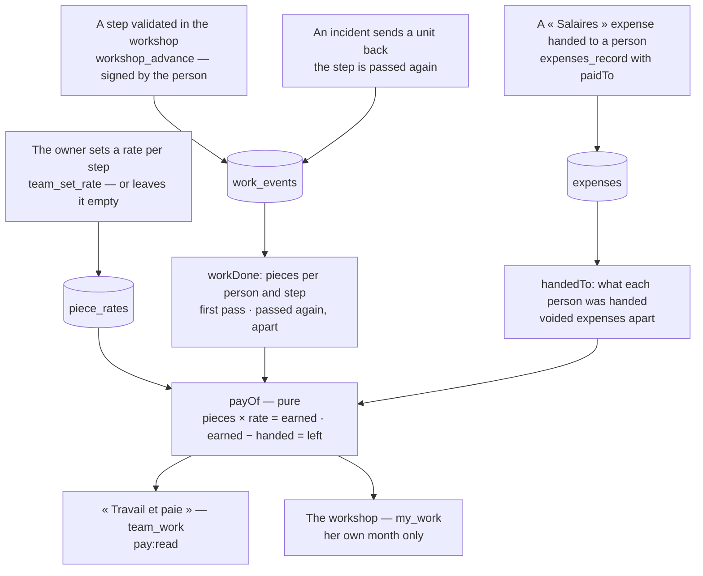

# The team's work, and pay by the piece

Nothing is typed twice: the work comes from the steps each person validated, the money from the
expenses that say who received them. An advance is an expense like another — it goes through the
till's rules, counts in the month's charges, and can be voided with a reason.

A piece passed again after a rework is counted apart and not paid a second time. A step with no
rate is counted and earns nothing: Nettio proposes no rate.
