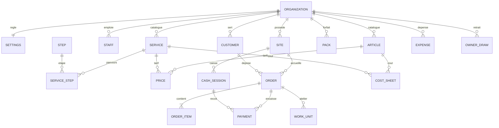

# Modèle — Nettio

> Le modèle du métier, tel que le code doit l'écrire. Les noms entre accents graves sont ceux du
> code (anglais) ; `referentiels.md` donne les mots des écrans.

## Vue d'ensemble

Toute table porte `organization_id` et sa politique RLS dans la migration qui la crée.

## Les réglages (`settings`)

Une ligne par organisation.

| Champ | Valeurs | Effet |
|---|---|---|
| `profile` | `starting`, `established`, `multi_site` | Le démarrage proposé, les écrans mis en avant |
| `staffing` | `solo`, `team` | `solo` : un seul écran d'accueil, ni rôles ni étapes d'atelier imposés |
| `tracking` | `bag`, `piece` | Le grain du suivi en atelier |
| `currency` | `XOF` par défaut | Affichée « F CFA » ; montants entiers |
| `promised_hours` | 48 par défaut | Délai proposé pour la date promise |
| `express_hours` | 24 par défaut | Délai en express |
| `working_days` | 26 par défaut | Jours travaillés par mois, pour le point mort |
| `labor_is_variable` | faux par défaut | Vrai si l'atelier est payé à la pièce |
| `labor_minute_cost` | montant | Coût d'une minute de travail, pour les fiches de coût |
| `dormant_days` | 30 par défaut | Au-delà, un vêtement prêt « dort » |

## Les points (`sites`)

- `kind` : `counter` (accueille les dépôts, tient une caisse), `plant` (traite, ne reçoit pas de
  client), `counter_plant` (les deux : le pressing classique).
- `code` : une à trois lettres, unique dans l'organisation ; il préfixe les numéros de dépôt.
- Un pressing a au moins un point. Un dépôt naît dans un point qui accueille ; il est traité dans
  un point qui traite (le même, ou le centre auquel le comptoir est rattaché : `plant_site_id`).

## L'équipe (`staff`) et les droits

- La personne et l'organisation viennent du Compte Kete ; Nettio ne garde de son profil que le
  nom affiché à sa dernière connexion, pour lister l'équipe.
- Une personne de l'organisation qui se connecte apparaît dans l'équipe, **en attente d'un rôle**.
- `staff` rattache une personne à un **rôle métier** et à ses points : `owner` (patron),
  `manager` (gérant), `counter` (réception), `cashier` (caisse), `workshop` (atelier),
  `courier` (livreur), `accountant` (comptable, lecture seule).
- Les rôles `owner` et `admin` du Compte Kete sont patron d'office. Un `member` sans ligne `staff`
  ne voit rien du métier.
- `role_permissions` : ce que le patron a coché ou décoché pour chaque rôle métier, par-dessus
  les valeurs de départ (`referentiels.md`) ; le rôle patron garde tout, toujours. Si
  l'organisation gère les droits de Nettio dans Kete Enterprise, ce sont ses attributions qui
  décident. Une permission se vérifie côté serveur, pour
  toutes les surfaces ; un agent agit avec les droits de sa personne, jamais plus.
- En mode `solo`, le patron tient tous les rôles.

## Le catalogue

- **`articles`** : les types de pièce (chemise, pantalon, veste…). Nom, ordre, actif.
- **`steps`** : les étapes d'atelier que ce pressing connaît (tri, détachage, lavage, séchage,
  repassage, contrôle, emballage, rangement). Nom, ordre, actif. Le pressing en ajoute ou en retire.
- **`services`** : nom ; `nature` — `workshop` (passe par l'atelier), `counter_only` (se fait au
  comptoir : une retouche confiée, une vente), `logistics` (collecte, livraison) ; `pricing` —
  `per_piece` ou `per_kg` ; son **parcours** : la suite ordonnée de ses étapes (`service_steps`).
  Un service sans étape passe directement de « reçu » à « prêt ».
- **`prices`** : le prix d'un article pour un service (`per_piece`), ou le prix au kilo d'un service
  (`per_kg`, sans article). Un prix absent veut dire « ce service ne se vend pas pour cet article ».
- **`packs`** (forfaits) : nom ; `mode` — `pieces` ou `weight` ; `quota` (nombre de pièces ou
  kilos) ; `price` ; les services admis (tous si aucun n'est nommé) ; actif.

Modifier le catalogue ne change jamais un dépôt passé : chaque dépôt garde l'instantané de ses
libellés et de ses prix.

## Les clients (`customers`)

- Le téléphone, normalisé, est l'identifiant métier : unique dans l'organisation.
- Nom, `kind` (`person`, `business`), canal préféré (`whatsapp`, `telegram`, `sms`, `none`),
  consentement aux messages, préférences (amidon, cintre ou plié), note.
- Le client n'a pas de compte Nettio.

## Le dépôt (`orders`, `order_items`)

- **Numéro** : `<code du point>-<suite>`, par exemple `A-0412`. La suite est propre à chaque point
  et ne saute jamais.
- **Contenu réel, toujours** : une ligne par couple article-service, avec sa quantité (ou son poids
  pour un service au kilo). Un forfait ne dispense jamais de saisir le contenu.
- **Défauts d'origine** : notés par ligne (tache, bouton manquant), avec photo quand le stockage est
  branché.
- **Prix**
  1. Chaque ligne a son prix normal : `quantité × prix unitaire` (ou `poids × prix au kilo`).
  2. Sans forfait : le total est la somme des lignes.
  3. Avec un forfait `pieces` : les pièces admises sont couvertes jusqu'au quota, en commençant
     par les plus chères (le client garde le plus grand avantage) ; les pièces au-delà et les
     lignes non admises sont dues à leur prix normal. Total = prix du forfait + supplément.
  4. Avec un forfait `weight` : même règle sur les kilos admis.
  5. Une remise (montant, avec motif) se déduit du total, sans jamais le rendre négatif. Au-delà du
     plafond du rôle, elle demande un valideur.
  6. Express : un supplément en pourcentage réglé par le pressing (0 par défaut).
- **Cycle** : `received` → `in_progress` → `ready` → `collected` ; `cancelled` depuis `received` ou
  `in_progress`, avec motif. Un dépôt `collected` ou `cancelled` ne change plus.
- **Date promise** : proposée (`promised_hours` ou `express_hours`), modifiable.
- **Argent** : `total`, `paid` (somme des paiements moins les remboursements), `balance`.
  Remettre un dépôt dont le solde n'est pas nul demande la permission `orders:release_unpaid`.
- **Histoire** : chaque geste (créé, payé, avancé, prêt, remis, annulé, message envoyé) est une
  ligne datée et signée (`order_events`), en plus du journal des commandes du châssis.

## L'argent

### Encaissements (`payments`)

Montant, moyen (`cash`, `mobile_money`, `card`, `transfer`), nature (`deposit` acompte, `balance`
solde, `refund` remboursement), l'auteur, la date, et la session de caisse pour les espèces. Un
paiement ne se supprime pas : une erreur se corrige par un remboursement motivé.

### La caisse (`cash_sessions`, `cash_movements`)

- Une session par point et par caissier : fond d'ouverture, mouvements, comptage, écart, clôture.
- **Attendu** = fond + espèces encaissées − remboursements en espèces − dépenses payées par la
  caisse − retraits du patron − versements en banque.
- **Écart** = compté − attendu. Il est gardé, jamais corrigé.
- Une seule session ouverte par point et par caissier.

### Dépenses et charges (`expenses`)

Une seule table pour tout ce qui sort : date, libellé, catégorie (`referentiels.md`),
**comportement** `fixed` ou `variable`, montant, payé par (`till` la caisse, `mobile_money`, `bank`,
`other`), récurrente ou non, justificatif. Une charge récurrente se recopie chaque mois tant
qu'elle n'est pas arrêtée.

### Ce que le patron prend (`owner_draws`)

Un retrait du patron n'est pas une dépense : il se montre à part. C'est la distinction qui permet
de dire « tu gagnes 254 500, tu as déjà pris 70 000 ».

### Le résultat d'une période

- **Encaissé** = paiements − remboursements de la période.
- **Dépenses et charges** = somme des `expenses` de la période.
- **Résultat** = encaissé − dépenses et charges. Sur l'encaissé, parce que c'est ce que le patron
  peut vérifier dans sa caisse.
- **Dehors** = somme des soldes des dépôts non annulés. **Dorment** = dépôts `ready` depuis plus de
  `dormant_days`.
- Les hypothèses sont toujours affichées avec le chiffre.

## Les coûts

### La fiche de coût (`cost_sheets`)

Par couple article-service : `labor_minutes`, `consumables_cost`, `machine_cost`, la date de mesure,
et si elle est **mesurée** ou **estimée**.

- **Coût variable** d'une pièce = consommables + machine (+ `labor_minutes × labor_minute_cost` si
  `labor_is_variable`).
- **Charges fixes du mois** = `expenses` de comportement `fixed` (+ la main-d'œuvre si elle n'est
  pas variable).
- **Part des charges fixes** d'une pièce : les charges fixes du mois réparties au prorata des
  minutes de travail de chaque pièce traitée dans le mois (à parts égales si aucune minute n'est
  connue).
- **Coût complet** = coût variable + part des charges fixes.
- Un couple sans fiche n'a pas de coût : Nettio le dit (« jamais mesuré ») et ne l'invente pas.

### La marge

- **D'une ligne** = son montant dû − coût complet des pièces.
- **D'un forfait vendu** = prix du forfait − coût complet de son contenu réel.
- **D'un forfait sur une période** = la moyenne sur ses ventes, avec son contenu moyen.
- **Le garde-fou** : au comptoir, une remise ou un forfait qui fait passer la commande sous son coût
  variable est signalé. Il ne bloque jamais ; le patron est prévenu.

### Le point mort

- **Contribution moyenne par pièce** = (encaissé du mois ÷ pièces du mois) − coût variable moyen.
- **Point mort du mois** = charges fixes ÷ contribution moyenne par pièce ; par jour, divisé par
  `working_days`.
- Si la contribution est nulle ou négative, Nettio l'écrit en clair au lieu d'afficher un nombre.

### Le rapprochement

Chaque mois : ce que les fiches prévoyaient en coûts variables pour le volume traité, face aux
dépenses variables réelles. L'écart désigne une fiche fausse ou un gaspillage.

## L'atelier (`work_units`)

- Au grain `bag` : une unité de travail par dépôt et par service qui passe par l'atelier. Au grain
  `piece` : une par pièce.
- Chaque unité suit le parcours de son service, étape par étape. Une étape se valide d'une touche ;
  elle est signée et datée.
- Un dépôt passe à `in_progress` à sa première étape, et à `ready` quand toutes ses unités ont fini
  leur parcours (ou d'une touche quand aucun service ne passe par l'atelier).
- **Incident** : sur une unité, avec son type (tache restante, dégât, pièce manquante, objet
  trouvé), une note, une photo ; il peut renvoyer l'unité à une étape (reprise). Une reprise se
  compte à part.
- **Emplacement** : où le dépôt est rangé une fois prêt.

## Les messages

- Un message part par le canal préféré du client, WhatsApp ou Telegram, derrière le port des
  canaux ; il est journalisé (`messages`) avec son état. Sans canal : impression ou SMS.
- Modèles réglés par le pressing : reçu, « c'est prêt », rappel. Rien ne part sans que le pressing
  l'ait activé.
- En entrée : « où en est ma commande ? » reçoit une réponse calculée, jamais inventée.

## Les évènements (vers Kete)

Des faits et des compteurs, jamais un nom, un téléphone ni un prix : `order.received`,
`order.ready`, `order.collected`, `metrics.daily`.
