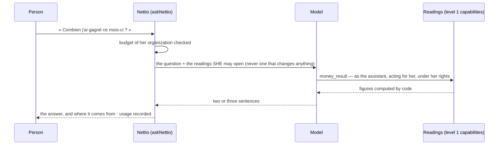

# assistant — Kete Intelligence at every station

What Nettio says by itself, and what it answers (specs/007-intelligence;
`docs/product/decisions.md`, « L'intelligence »; `docs/product/voix.md`).

| Gesture | Capability | Permission | Autonomy |
|---|---|---|---|
| The day's statement | `day_statement` | `money:read` | 1 |
| Ask a question (« Demander ») | — a screen and its server function | `assistant:ask` | — |

## The day's statement — no model

`domain/statement.ts`: a pure function. The figures come from the day's deposits and payments, the
tills, the workshop and the month's result; the sentences are fixed words from the catalogue. A
copilot reads it through MCP and quotes it as it is.

## « Demander »

- **The model never computes**: every figure comes from a reading (constitution II). The system
  prompt (`ask.ts`) says it, and the model is given nothing else to compute from.
- **The person's rights, never more**: `registry.tools(caller)` only returns what she may open; a
  cashier's question cannot reach the result. Only level 1 is kept: nothing that changes anything
  is offered, not even as a draft.
- **Never the database**: the model receives the question and what the readings returned.
- **Metered**: each call's usage is recorded per organization (`kete_ai_usage`); a monthly budget,
  when the operator set one, is enforced before the call.
- **Not connected, said**: without `NETTIO_AI_PROVIDER`, `NETTIO_AI_MODEL` and `NETTIO_AI_API_KEY`,
  « Demander » says so. Nothing is simulated.

## Copilots

Every capability of Nettio is an MCP tool at `/mcp`, with the rights of the person who signed in:
a copilot reads, and prepares drafts that a person validates (level 3) or confirms in Nettio
(level 4). No extra code here.

## Evaluating the real model

`pnpm eval:ask` (after `pnpm demo` created the demo laundry) asks « Demander » eight questions with
the model of the environment, and checks each answer in code: it carries the figure the code
computed, says « never measured » rather than guessing, advises no price, acts on nothing, and
never reaches what the person may not open. A small smoke test — to grow with the pilot's real
questions.

## Not built

Voice and photo entry of a deposit; the evening statement sent by itself. See the spec's « Known
limits ».
