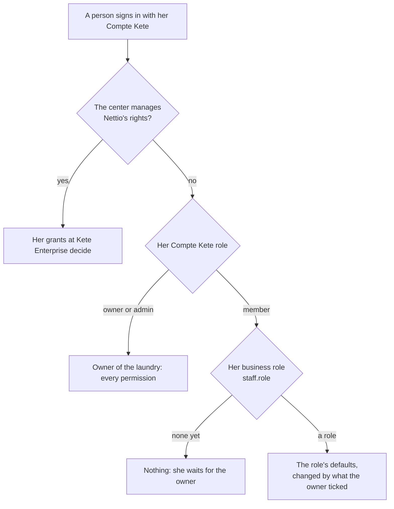

# business — the laundry sets itself up

The settings, the sites, the team and its rights, the guided start, and the diagram of the business
(specs/001-foundation; `docs/product/model.md`).

| Gesture | Command | Capability | Permission | Autonomy |
|---|---|---|---|---|
| Read the laundry | — | `business_overview` | `business:read` | 1 |
| Start the laundry, once | `set-up-business` | `business_set_up` | `settings:manage` | 3 |
| Change the settings | `change-settings` | `business_change_settings` | `settings:manage` | 3 |
| Add or change a site | `save-site` | `business_save_site` | `settings:manage` | 3 |
| Read the team and the rights | — | `team_read` | `staff:manage` | 1 |
| Give a person her role | `set-staff-role` | `team_set_role` | `staff:manage` | 3 |
| Tick what a role may do | `set-role-permissions` | `team_set_role_permissions` | `staff:manage` | 3 |

An agent that changes the configuration only prepares a draft; a person validates it.

## Rules (pure, in `domain/`)

- `sites.ts` — a code belongs to one site; a counter is attached to a site that processes; the
  business keeps one site that receives; a plant others send to cannot stop.
- `roles.ts` — the owner role holds everything, always; any other role holds its defaults, changed
  by what the owner ticked or unticked (`role_permissions.granted`); a permission he never touched
  keeps its default, so a new one arrives with it.
- `starter.ts` — what a laundry starts with: its sites by profile, eight steps, four services with
  their routes, twelve articles. Never a price.
- `flow.ts` — the diagram, a pure function of the settings.

## Who holds what

Checked on the server for every surface (`platform/rights.ts`): a screen, the MCP endpoint, the
API, an agent acting for a person.

## The diagram

`businessFlow({ sites, services, steps, words, perRow })` returns boxes and links in three sections,
one under the other: the sites (which counter sends to which plant), one lane per service (its
route step by step), the life of a deposit. `perRow` is how many boxes fit side by side: a route
wraps onto the next row on a phone. `ui/FlowDiagram.tsx` paints it with `@xyflow/react` and the
tokens of `@kete/design`; it fits the width and takes the height it needs. The same routes are
listed as text under it.
