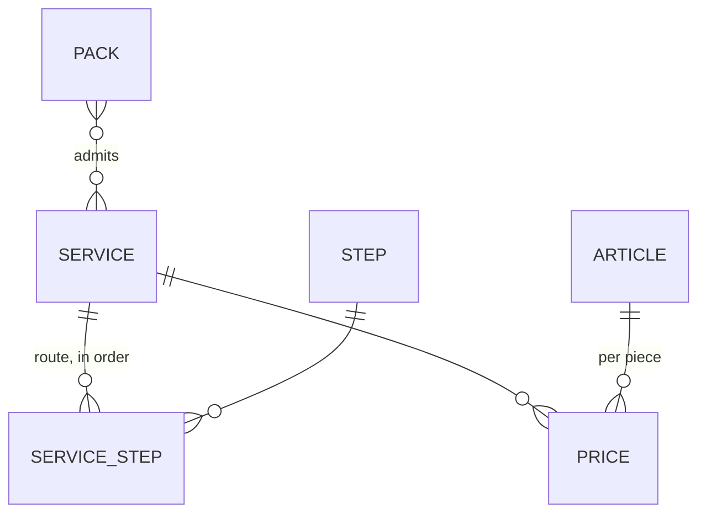

# catalog — what the laundry treats, does and charges

Articles, workshop steps, services with their routes, prices, packs (specs/001-foundation, US3;
`docs/product/model.md`).

| Gesture | Command | Capability | Permission | Autonomy |
|---|---|---|---|---|
| Read the catalogue and its gaps | — | `catalog_read` | `business:read` | 1 |
| Add, rename or retire an article | `save-article` | `catalog_save_article` | `catalog:manage` | 3 |
| Add, rename or retire a step | `save-step` | `catalog_save_step` | `catalog:manage` | 3 |
| Add or change a service and its route | `save-service` | `catalog_save_service` | `catalog:manage` | 3 |
| Set or remove a price | `set-price` | `catalog_set_price` | `catalog:manage` | 3 |
| Add or change a pack | `save-pack` | `catalog_save_pack` | `catalog:manage` | 3 |

## Rules (pure, in `domain/catalog.ts`)

- A route names known, active steps, each once; only a workshop service has one. A service with no
  step goes from « received » to « ready » directly.
- A per-piece service has one price per article; a per-kilo service has one price, for a kilo. No
  price means the couple is not sold.
- A pack counts pieces or kilos and admits services of its own mode: those it names, or all.
- A step on the route of a service in use cannot be retired; a service with prices or packs keeps
  its way of pricing.
- `catalogGaps` says what is missing before the counter can sell; nothing is guessed.

**Nettio never proposes a price** (constitution III): the starter catalogue has names only, and an
agent writes the price the owner dictated, as a draft.

Changing the catalogue never changes a past deposit: a deposit keeps the snapshot of its labels and
prices (specs/002).

