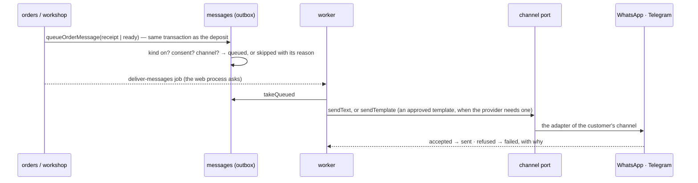

# messaging — the laundry writes to its customers, on WhatsApp and Telegram

The customer installs nothing (specs/006-messaging; `docs/product/model.md`, « Les messages »;
`docs/product/voix.md`; `docs/decisions/0004`).

| Gesture | Command | Capability | Permission | Autonomy |
|---|---|---|---|---|
| What the laundry decided, the channels' state | — | `messages_settings` | `messages:read` | 1 |
| The messages, with their reason | — | `messages_list` | `messages:read` | 1 |
| A customer's Telegram link | — | `messages_telegram_link` | `messages:read` | 1 |
| Turn a kind on or off, write its words | `set-message-template` | `messages_set_template` | `messages:manage` | 3 |
| Send a failed message again | `resend-message` | `messages_resend` | `messages:manage` | 3 |
| Chase what sleeps | `remind-sleeping-orders` | `messages_remind` | `messages:manage` | 3 |

## Rules (pure, in `domain/messages.ts`)

- **Nothing leaves unless the laundry decided it**: three kinds — `receipt`, `ready`, `reminder` —
  each off until it is turned on, each with the laundry's own words. An agent never writes to the
  laundry's customers alone (constitution III).
- **The words are the laundry's, the figures are computed**: a template may name `{client}`
  `{numero}` `{contenu}` `{total}` `{paye}` `{reste}` `{date}` `{pressing}`; anything else is
  refused.
- **The customer chooses, and may stop**: `routeFor` says where a message goes — WhatsApp by her
  phone, Telegram once she opened the laundry's bot — or why it does not leave (`no_consent`,
  `no_channel`, `sms_not_connected`, `telegram_not_linked`). « stop » withdraws her consent.
- **A reminder** leaves for a ready deposit that sleeps, at most once a week, on the laundry's
  gesture — never by itself.
- **Every message is a row** — sent, waiting, failed, not sent — with its reason.

## From a deposit to a phone

A channel with no credentials is **not connected**: its messages wait and the screen says so.
Nothing is simulated; the receipt can always leave from the laundry's own messaging.

## When a customer writes

`hear` (delivery.ts): the webhook is authenticated first (`src/platform/inbound.ts`), then

- `/start <token>` on Telegram ties her chat to her customer record (the link of her receipt);
- « stop » withdraws her consent;
- anything else is answered with the state of her open deposits — computed, never invented.

An unknown sender gets no answer. Finding whose customer a sender is crosses the organizations'
boundary: three SQL functions return identifiers only, and nothing else does.

## Ports and adapters

The feature knows `ChatChannel` (`@kete/notify`) and `Channels`; no vendor is named in it. The
adapters — `src/platform/whatsapp.ts` (Meta Cloud API), `src/platform/telegram.ts` (Bot API) — were
written from Firmo's and are tested against recorded exchanges, not the live services.
