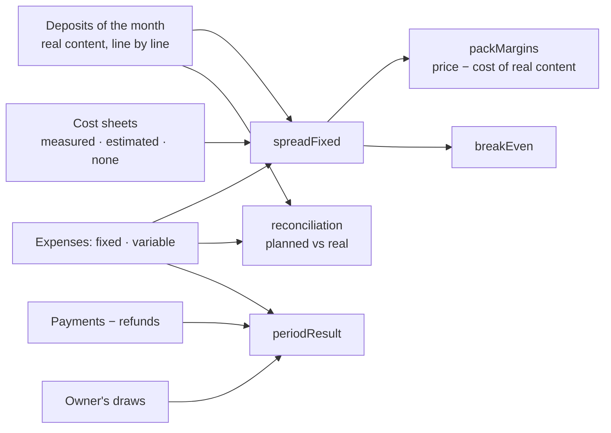

# money — the till, what goes out, and whether the laundry earns

The heart of Nettio (specs/003-money-day, 004-earn; `docs/product/model.md`, « L'argent », « Les
coûts »): the owner knows whether he earns money, and on what.

| Gesture | Command | Capability | Permission | Autonomy |
|---|---|---|---|---|
| The tills | — | `cash_sessions` | `cash:operate` | 1 |
| Open a till | `open-cash-session` | `cash_open` | `cash:operate` | 4 |
| Close it, with its gap | `close-cash-session` | `cash_close` | `cash:operate` | 4 |
| Carry cash to the bank | `deposit-cash-at-bank` | `cash_deposit_at_bank` | `cash:operate` | 4 |
| The month's expenses | — | `expenses_list` | `expenses:read` | 1 |
| Record an expense | `record-expense` | `expenses_record` | `expenses:write` | 3 |
| Void one, with a reason | `void-expense` | `expenses_void` | `expenses:write` | 4 |
| Stop a recurring charge | `stop-recurring-expense` | `expenses_stop_recurring` | `expenses:write` | 3 |
| What the owner takes | `record-owner-draw` | `draws_record` | `draws:record` | 4 |
| The cost sheets | — | `costs_read` | `money:read` | 1 |
| Write a cost sheet | `save-cost-sheet` | `costs_save_sheet` | `costs:manage` | 3 |
| Whether I earn | — | `money_result` | `money:read` | 1 |

Costs, margins and the result are `confidential`: the owner's and his accountant's.

## Every figure is a pure function (`domain/`)

A model computes none of them (constitution II). Each is shown with its unit, its period and how it
is computed; a missing measure is said — « never measured » — and never estimated.

### The till — `till.ts`

```
expected = float + cash in − cash refunds − expenses from the till − owner's draws − bank deposits
gap      = counted − expected          (kept on the closed till, never corrected)
```

A team works with an open till — cash moves only into, or out of, the person's own open till at
the site; someone alone may work without one. Cash cannot leave a till that does not hold it.

### What goes out — `charges.ts`

A one-off expense counts in its period; a recurring charge counts every month from its start until
it is stopped; a voided one counts nowhere. Each is **fixed** or **variable**. A draw is not an
expense.

### What things cost — `costs.ts`

```
variable cost of a unit  = consumables + machine (+ minutes × cost of a minute, when paid by the piece)
fixed share of a unit    = the month's fixed charges × its minutes ÷ the minutes of the month's units
                           (equal shares while no minute is known)
complete cost            = variable cost + fixed share
margin of a pack sold    = its price − complete cost of the pieces it covered (their real content)
break-even               = fixed charges ÷ (cashed ÷ units − average variable cost)
planned against real     = Σ quantity × variable cost  vs  the month's variable expenses
result                   = cashed − charges ;  left = result − what the owner took
```



**What is not measured is said.** A pack whose sale contains an article with no sheet is left out
of the average and counted apart (« in part »); a sheet that is only estimated says so beside every
margin. **A pack sold at a loss is shown as it is**: Nettio advises no price (constitution III).

## The guard-rail

When a deposit is received, its total is compared with the variable cost of its content (only when
every line has a sheet). Under it, the deposit is flagged in its history and counted in the
month's result; it is never blocked. Whoever may not read the money sees the flag, not the cost.

## Reading other features' tables

The month's figures read `orders`, `order_items` and `payments` by SQL (`money.tables.ts`), under
the same row-level security; the orders feature calls this one for the till and the guard-rail
(`tillFor`, `guardRail`), never the reverse.
