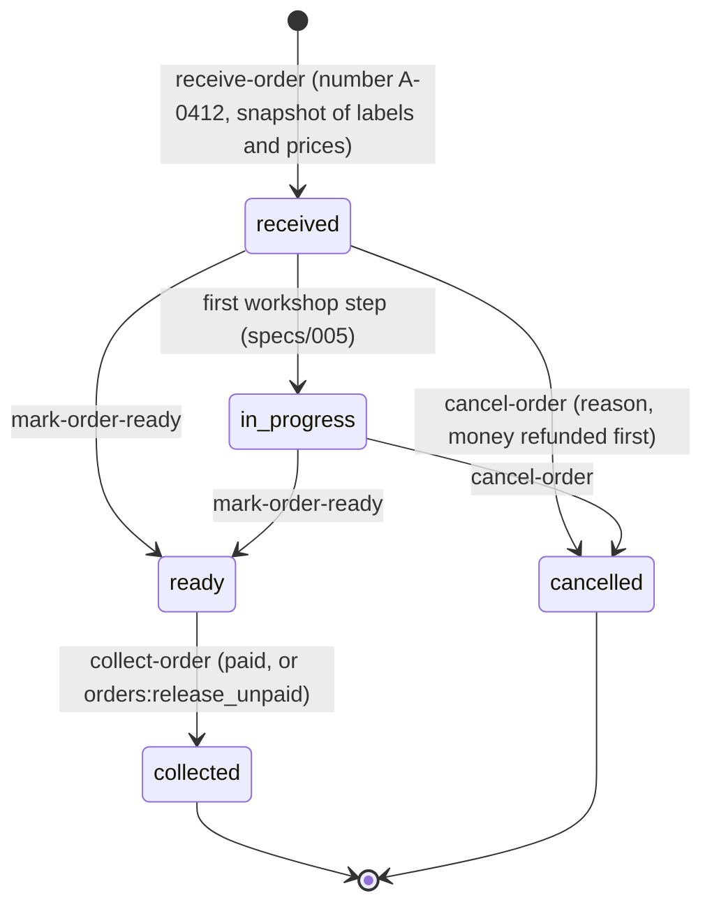

# orders — a deposit, its real content, its money

The counter (specs/002-counter; `docs/product/model.md`, « Le dépôt », « Encaissements »).

| Gesture | Command | Capability | Permission | Autonomy |
|---|---|---|---|---|
| What the counter needs | — | `orders_counter` | `orders:create` | 1 |
| List deposits by stage | — | `orders_list` | `orders:read` | 1 |
| One deposit in full | — | `orders_get` | `orders:read` | 1 |
| The figures of a day | — | `orders_today` | `orders:read` | 1 |
| Receive a deposit | `receive-order` | `orders_receive` | `orders:create` | 3 |
| Mark it ready | `mark-order-ready` | `orders_mark_ready` | `workshop:operate` | 3 |
| Hand it over | `collect-order` | `orders_collect` | `payments:collect` | 4 |
| Cancel it | `cancel-order` | `orders_cancel` | `orders:cancel` | 4 |
| Take money | `record-payment` | `payments_record` | `payments:collect` | 4 |
| Give money back | `refund-payment` | `payments_refund` | `payments:refund` | 4 |

An agent prepares a deposit (a voice note, a photo: level 3); it never cashes, hands over, cancels
nor refunds alone (level 4: a person, who confirms).

## The price — `domain/pricing.ts`

One pure function, `priceOrder`, used by the server when the deposit is received and by the screen
while it is typed.

1. Each line has its normal price: quantity × unit price (kilos rounded to the franc).
2. A pack covers the lines it admits up to its quota, **the most expensive first**; what it does not
   cover is due at its normal price. Total = pack price + supplement.
3. Express adds a percentage of the total before discount.
4. A discount is deducted and never makes the total negative; it needs a reason, and the right
   (`orders:discount`) above the laundry's ceiling.

**The real content is always kept**, even under a pack: each line stores its quantity, what the
pack covered of it and what is due. That is what the margin of a pack will be computed on
(specs/004).

## The life of a deposit — `domain/order.ts`

- A number is the code of the site and the next number of that site: its own series, never skipped
  (the site's row is locked; a refused deposit rolls its number back).
- Money never exceeds what is due; a payment is an advance (`deposit`) or settles the deposit
  (`balance`). Money is never deleted: a `refund`, with a reason, corrects an error.
- Every gesture appends a line to `order_events`: dated, signed by the person or the agent.
- A gesture carries a key: sent twice (a double tap, a retry), it runs once.
- A person attached to some sites only works there.

## What leaves the organization

Events to the center — `order.received`, `order.ready`, `order.collected` — carry identifiers and
counts only: never a name, a phone nor a price (tested).

## The receipt

`/depots/$orderId/recu`: a ticket to print, and the same words as a message the laundry sends from
its own WhatsApp or Telegram (`ui/receipt.ts`). The channel adapters arrive with specs/006.

## A deposit said in a sentence, dictated, or photographed

`understand.ts` (specs/011-dictate, `docs/flows/a-deposit-said.md`): a model places the clerk's
words on the catalogue, and `domain/understand.ts` — pure — keeps only the couples that have a
price, in quantities that can be, naming what it dropped. It fills the form of « Nouveau dépôt »
and writes nothing: the person checks, and saves through `orders_receive`. The model sees names
and identifiers, never a price. A picture (specs/014-photo) takes the same path: a written list is
read as written, a pile is never counted by guess. `pnpm eval:dictate` measures both with the real
model.

What leaves the organization here: the sentence, the recording or the picture, and the catalogue's names, go
to the model's provider — only when the laundry's Nettio has a model configured.

## The deposit as a basket

« Nouveau dépôt » (specs/018-basket) shows the deposit as a basket: one deposit holds several
services at once, each service's chip says what it already holds, and the basket — beside the
articles on a wide screen, one touch away on a phone — lists it service by service with its total.
Nothing moves under the finger while pieces are added.
