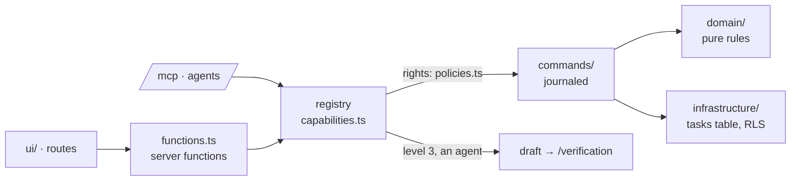

# Tasks — the example feature

Every layer of a Kete App feature, small enough to read in ten minutes, and to replace by the
app's first real feature.

| Capability       | Level | An agent…                                   |
| ---------------- | ----- | ------------------------------------------- |
| `tasks_list`     | 1     | reads them, shown as a table in its copilot |
| `tasks_complete` | 2     | completes one; the person may reopen it     |
| `tasks_create`   | 3     | prepares a draft; the person validates it   |

Lifecycle: `open` → `done` (complete-task) → `open` (reopen-task).
