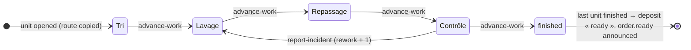

# workshop — « je sais quoi faire maintenant »

The work of a deposit, step by step (specs/005-workshop; `docs/product/model.md`, « L'atelier »).

| Gesture | Command | Capability | Permission | Autonomy |
|---|---|---|---|---|
| What waits, step by step | — | `workshop_queue` | `workshop:operate` | 1 |
| The work of one deposit | — | `workshop_order` | `orders:read` | 1 |
| The open incidents | — | `workshop_incidents` | `workshop:operate` | 1 |
| Validate a step | `advance-work` | `workshop_advance` | `workshop:operate` | 3 |
| Report an incident, maybe a rework | `report-incident` | `workshop_report_incident` | `workshop:operate` | 3 |
| Close an incident | `resolve-incident` | `workshop_resolve_incident` | `workshop:operate` | 3 |
| Say where a deposit is stored | `store-order` (orders) | `orders_store` | `workshop:operate` | 3 |

## Rules (pure, in `domain/work.ts`)

- **Opening units** — when a deposit is received, at the site that processes it (the counter
  itself, or the plant it sends to). At the `bag` grain: one unit per service that goes through the
  workshop. At the `piece` grain: one per piece; a line by the kilo is one unit. A service with no
  step opens none.
- **The route is a snapshot** — a unit keeps the route its service had when the deposit was
  received; a later change of the catalogue never touches it.
- **Advancing** — one touch validates the step a unit waits at: signed and dated (`work_events`).
- **Ready** — the deposit becomes « in progress » at its first step and « ready » when every unit
  finished its route. With work left, it cannot be marked ready by hand: never with a piece still
  on a table.
- **Rework** — an incident may send a unit back to an earlier step of its own route; the rework is
  counted on the unit, and a deposit that was ready goes back to « in progress ».

## Dependencies

The workshop's door depends on the orders feature (a step changes the deposit's status and
history). The other way round, the counter opens a deposit's units and asks whether work is left
through `infrastructure/units.ts` and `domain/work.ts` directly — those two files import nothing
of orders, so there is no cycle.
